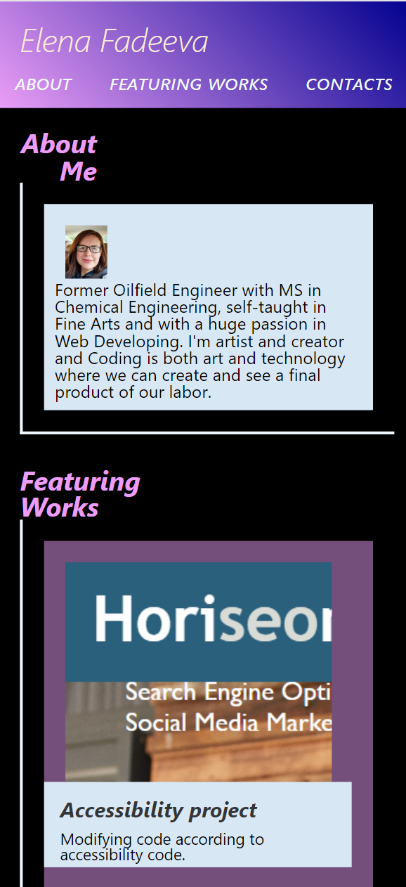

# Elena Fadeeva Profile Webpage.

## Description

This project was created to make the personal profile page for Web Developer student :
- The page presents the developer's name, a recent photo or avatar, and links to sections about them, their work, and how to contact them
- After a click one of the links in the navigation  the UI scrolls to the corresponding section
- After a  click on the link to the section about their work the UI scrolls to a section with titled images of the developer's applications
- When a cursor is positioned at the work, it is enlarged
- After a click on the images of the applications the viewer is taken to that deployed application
- The webpage is presented with responsive layout that adapts to a different viewpoints

## Usage

After clicking the link below you will be able to see deployed application.

https://elenafwork.github.io/02-Portfolio/
 

The webpage looks like this on the computer screen: 

  

The webpage's look on smart phone screen: 

  

## Credits

## License
 
Please , refer to the repo license.

